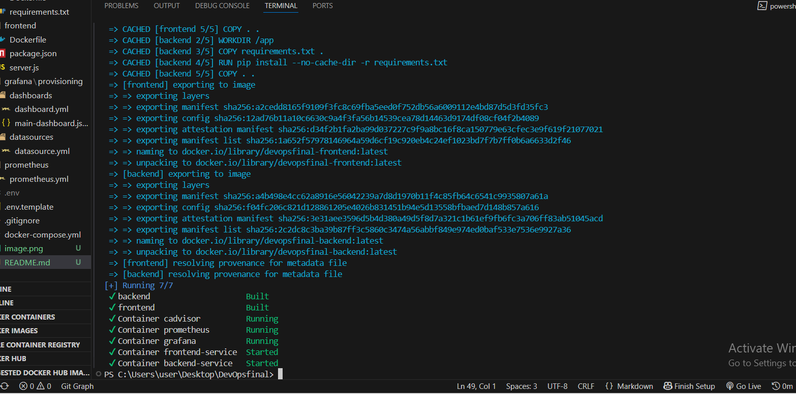
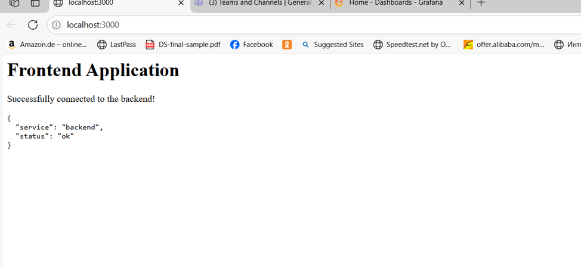
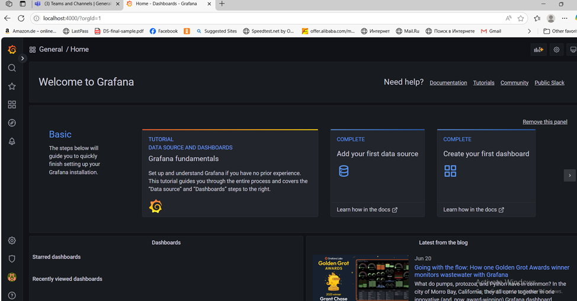
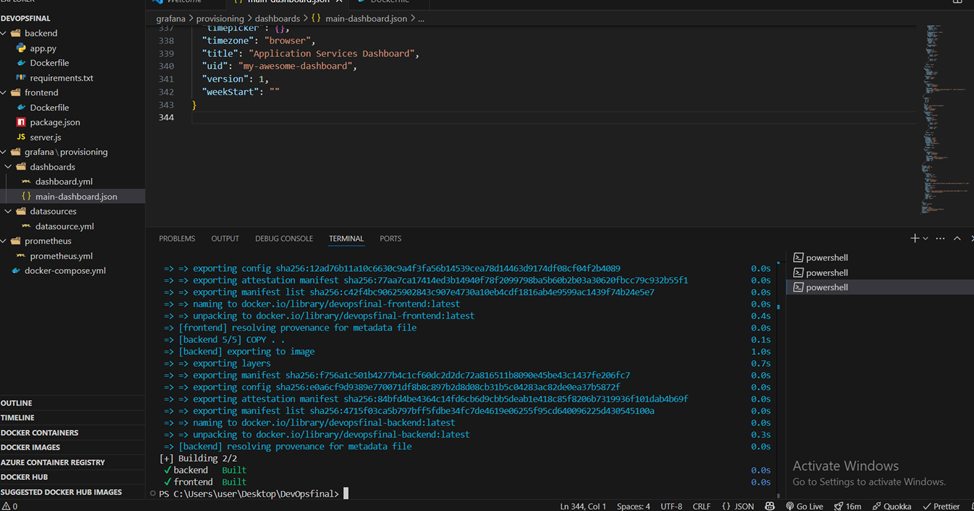
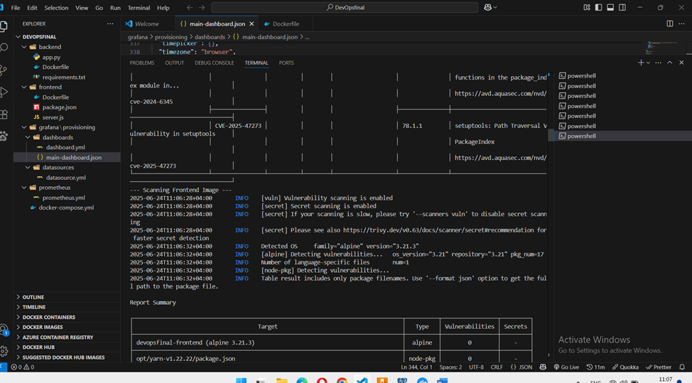
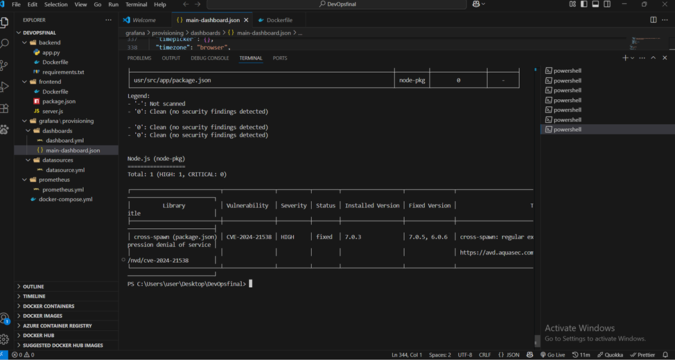

# DevOps Final Project: A Complete Pipeline for a Multi-Service Application

Welcome to my final project! This repository isn't just a collection of code; it's a fully-functional demonstration of a modern DevOps pipeline built from the ground up. I've taken a standard multi-service application and wrapped it in a secure, observable, and automated infrastructure using industry-standard tools.

The core philosophy here is "Infrastructure as Code." Everything from the application services to the monitoring dashboards and security policies is defined in code, version-controlled with Git, and ready for automated deployment.

### Application & Monitoring Architecture

The entire stack is orchestrated by Docker Compose. Here’s a quick look at how the services interact:

- **Frontend:** A Node.js web app that acts as the user's point of entry. It calls the backend API to fetch and display data.
- **Backend:** A Python Flask API that serves data to the frontend. More importantly, it's instrumented to expose application-level performance metrics via a `/metrics` endpoint.
- **Prometheus:** The heart of our monitoring system. It's configured to periodically "scrape" metrics from both our backend application and from cAdvisor.
- **Grafana:** The eyes of our system. It uses Prometheus as a data source to visualize all our collected metrics on a powerful, pre-built dashboard.
- **cAdvisor:** A container monitoring agent that gives us deep visibility into the resource usage (CPU, Memory, Network) of every running container.

---

## 🚀 Setup Instructions

Getting this entire environment running on your machine is incredibly simple.

### Prerequisites

- Docker & Docker Compose
- Git
- Trivy (for security scanning)
- (For Bonus) Ansible, running within a WSL environment on Windows.

### Installation

```bash
# 1. Clone this repository to your computer
git clone https://github.com/Anikelenjeridze/DevOpsFinal.git


# 2. Configure Your Secrets
# Create a local environment file from the template. This file is safely
# ignored by Git and will hold your secrets.
cp .env.template .env

# 3. Launch the entire stack!
# This single command builds the container images and starts all services
# in the background.
docker-compose up -d --build



That's it! All services are now running.
Accessing the Services
Frontend Application: http://localhost:3000
Grafana Dashboard: http://localhost:4000
Login: admin / admin (you will be prompted to change it)
Prometheus UI: http://localhost:9090 (to see raw metrics and target status)





🛠️ How Monitoring and Security Were Implemented
This project demonstrates key DevOps principles in practice. Here's a breakdown.
Monitoring & Visualization
I implemented a robust, pull-based monitoring system that gives us real-time insight into the health of our application and infrastructure.
Metric Exposure: The Python backend uses the prometheus-flask-exporter library to create a /metrics endpoint. This exposes custom application metrics, like flask_http_requests_total.

Metric Collection: The prometheus.yml file configures Prometheus to automatically scrape metrics from the backend and cAdvisor every 15 seconds.
Automated Visualization: Grafana is provisioned with its data source and dashboard automatically on startup. The configurations in the grafana/provisioning directory mean the dashboard is live and ready the moment Grafana starts, requiring zero manual setup.
This provides a complete view of our system's performance, from container resource usage to application-specific request counts.
Grafana Dashboard


Security (DevSecOps)


Security was not an afterthought; it was integrated throughout the development process.
Secrets Management: Sensitive data like API keys are never hard-coded or committed to Git. They are managed in a local .env file (which is in .gitignore) and securely injected into the containers as environment variables at runtime by Docker Compose.
Vulnerability Scanning: I used Trivy to scan my final Docker images for Common Vulnerabilities and Exposures (CVEs). This "shift-left" approach ensures we catch security flaws before they ever reach a production environment.
The process was:
Scan: Run Trivy against the built images.
Identify: The initial scan revealed several HIGH and CRITICAL vulnerabilities in the base OS packages.
Remediate: I addressed these by updating the base image in the Dockerfile to a newer, patched version (e.g., from python:3.9-slim to python:3.9-slim-bookworm).
Verify: A final scan confirmed that all critical vulnerabilities were resolved.
Trivy Scan Results
This screenshot shows the final, "clean" scan of the backend image after remediation, confirming no HIGH or CRITICAL vulnerabilities remain.


Incident Management & Automation
Post-Mortem: A simulated outage was performed to test the system's resilience. The detection, response, and preventative measures are documented in the POST-MORTEM.md file.


Automation (Bonus): The ansible/ directory contains a playbook that automates the deployment of this stack, demonstrating Infrastructure as Code for provisioning.
Tearing Down the Environment
When you're finished, you can stop and remove all the project's containers, networks, and volumes with a single command:
Generated bash
docker-compose down
```
